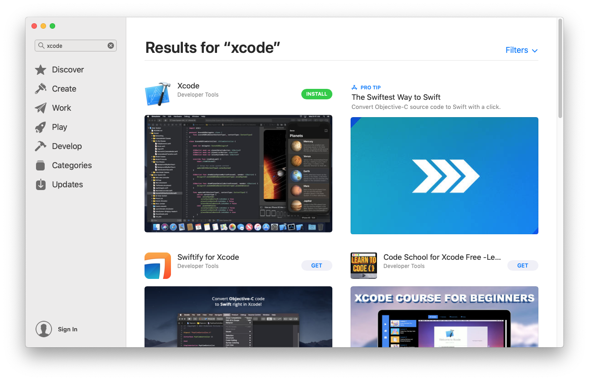
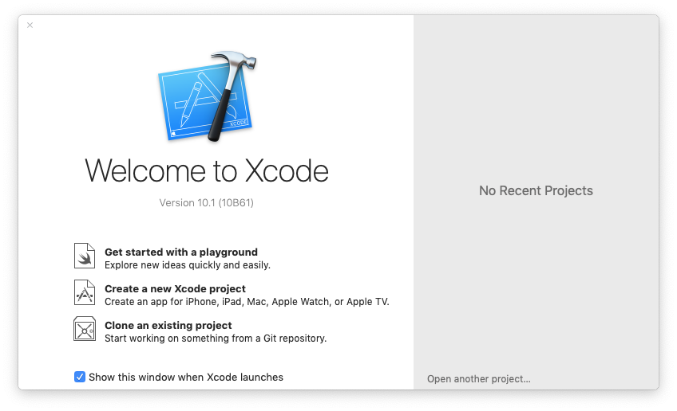
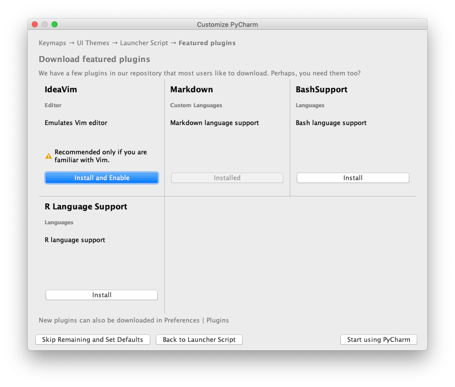
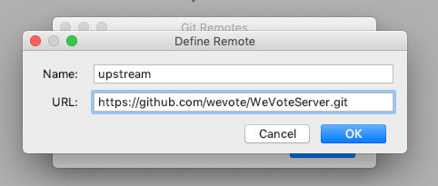
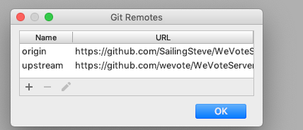
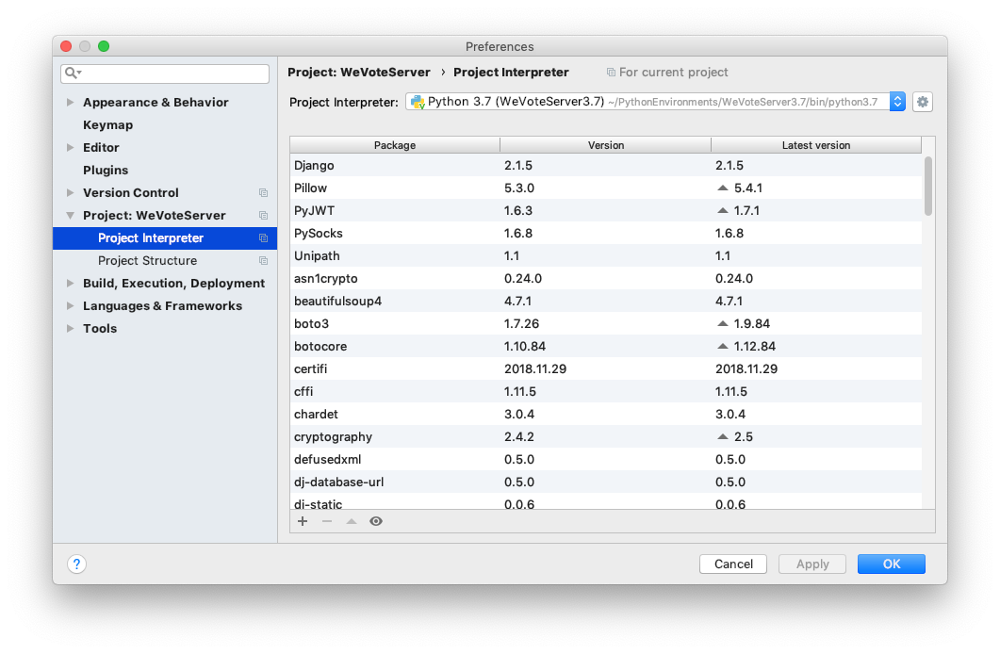
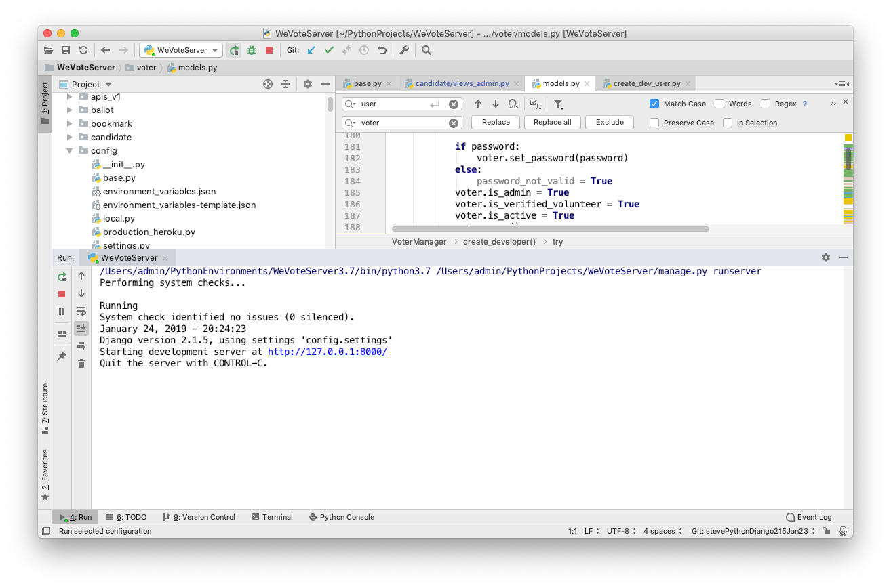
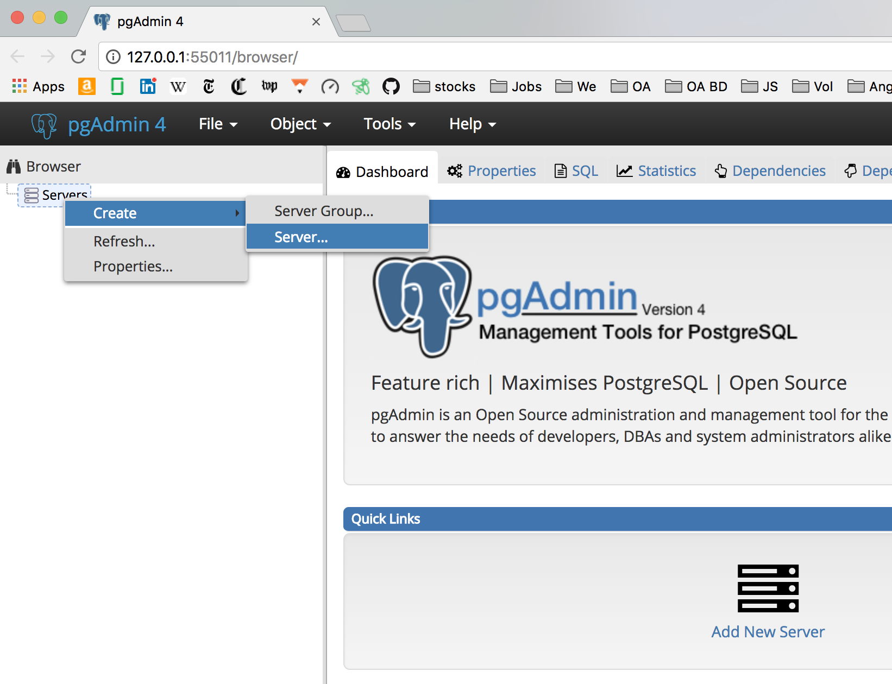
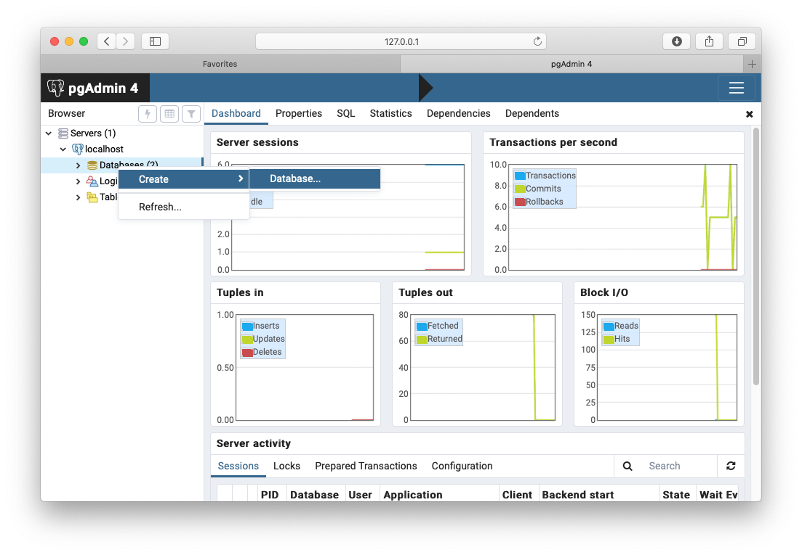

# README for Simplified Installation with PyCharm on a Mac
[Back to root README](../README.md)

## Installing WeVoteServer: On a new Mac
These instructions are for a new Mac, or at least a Mac that hasn't been used for 
Python development before.  Some of these tools may already be setup on your Mac, but
reinstalling them causes no harm, skip the parts you are sure you already have.

1. Install the Chrome browser for Mac

1. Open the Mac "App Store" app, and download Apple's Xcode, which includes "c" language compilers and native git integration.

    

1. Start xcode (you can find it with Spotlight, or in the Application folder)

    

1. When prompted, download the "Additional Components" tools (takes a while)

1. When you get to Weclome to Xcode, quit out of the app (the tools we need are command line tools
    that have been installed.)

    

1. Download and install the Community version of PyCharm, it's free!
    [https://www.jetbrains.com/pycharm/download/#section=mac](https://www.jetbrains.com/pycharm/download/#section=mac)

1. Start PyCharm and enable the Markdown and BashSupport tools (this takes a while)

    

1. Navigate in Chrome to [github](https://github.com).  Create an account if you don't already have one.
 
1. Within the github site, navigage to [https://github.com/wevote/WeVoteServer](https://github.com/wevote/WeVoteServer) Create a fork of wevote/WeVoteServer.git by selecting 
    the "Fork" button (upper right of screen)
    
1. In PyCharm, go to the VCS/Enable Version Control Integration menu choice dialog, and select "git"

    

1. In PyCharm set your git remotes, set the name for your personal github branch origin/develop
   
   

    The set the latest in the WeVote project's dev branch in github upstream/develop and the latest in your
   gitub branch
   
    
   
   and when done, it looks like this
   
     

1. In PyCharm copy `environment_variables-template.json` to `environment_variables.json`

    

    Right click on `environment_variables-template.json`, then paste it onto the `config` directory.
    A copy dialog will open up, and change the "new name:" to `environment_variables.json`
    
    If you skip this step, in a much later step when you run "makemigrations", it will fail with an 
    'Unable to set the SECRET_KEY variable from os.environ or JSON file' error.

1. In PyCharm, open up the Terminal window (from the list of options on the second from the bottom line in the IDE)
   
1. The terminal window will automatically start the session in the  `/Users/<YOUR NAME HERE>/PythonProjects/` directory.
   Type the following command to set up a git remote for upstream in github...
   
    `$ git remote add upstream git@github.com:wevote/WeVoteServer.git`
       
   This will open up an OSX dialog that asks you to install the "Apple Command Line Software Development Tools" which includes a binary for git.  You may 
   have to run this same command again after loading the command line software.
       
1. In the PyCharm terminal window download [Homebrew]( https://brew.sh/) ("the missing package manager for MacOS) by entering
the following command:

    `$ /usr/bin/ruby -e "$(curl -fsSL https://raw.githubusercontent.com/Homebrew/install/master/install)"`
    
    This loads a Ruby script (Ruby comes preloaded in MacOS), and runs it with curl (also preloaded).  The script uses
    sudo which temporarily gives the script root priviliges to install software, so you will need an admin password for
    your Mac.  

1. Install the latest Python (3.7.2) or higher.  This installs the python3 and pip3 executables 
    ```
    $ brew install python3
    $ brew link --overwrite python
    ```

1. Setup a virtual environment for running the WeVoteServer
    ``` 
    $ pip3 install --user virtualenv
    $ vim ~/.bash_profile
    ```
    
    Add the following to .bash_profile, save and quit:

   `alias virtualenv3='/Users/admin/Library/Python/3.7/lib/python/site-packages/virtualenv'`

    Update the current Terminal window to use the alias you just saved:

    `$ source ~/.bash_profile`

1. Create a place for the virtual environment to live on your hard drive. We recommend installing it 
outside of the `PythonProjects` folder.  Create it in a new `PythonEnvironments` directory off of your home dir:
    ```
    $ mkdir /Users/<YOUR NAME HERE>/PythonEnvironments/
    $ cd /Users/<YOUR NAME HERE>/PythonEnvironments/
    $ $ /Users/<YOUR NAME HERE>/Library/Python/3.7/bin/virtualenv WeVoteServer3.7
    ```
    
1. Now activate this new virtual environment for WeVoteServer:

    $ cd /Users/<YOUR NAME HERE>/PythonProjects/WeVoteServer/
    $ source /Users/<YOUR NAME HERE>/PythonEnvironments/WeVoteServer3.7/bin/activate
    $ virtualenv3 -p python3 WeVoteServer3.7
    
15. Install OpenSSL, the pyopenssl and https clients:
 
    `(WeVoteServer) $ brew install openssl`
    `(WeVoteServer) $ python3 -m pip install pyopenssl pyasn1 ndg-httpsclient`

    Link libssl and libcrypto so that pip can find them:
 
    ```
    $ ln -s /usr/local/opt/openssl/lib/libcrypto.dylib /usr/local/lib/libcrypto.dylib
    $ ln -s /usr/local/opt/openssl/lib/libssl.dylib /usr/local/lib/libssl.dylib
    ```
 
1. Install libmagic

    `(WeVoteServer) $ brew install libmagic`

1. Probably not needed, but make sure we have the latest pip

    `(WeVoteServer3.7) $ pip install --upgrade pip`

1. Install the other required Python packages

    `(WeVoteServer3.7) $ pip install -r requirements.txt`

    This is a big operation that loads a number of wheels (*.whl files are Python containers that contain
    pre-compiled c language objects that are made for the current MacOS) and then it compiles with gcc other 
    c language packages for which a current wheel does not exist.
    
    If this install succeeds with no missing libraries, or other compiler errors, we are
    most of the way to done.
    
1. Associate the new virtual environment with the project, so that the the
project starts running in the virtual environment:

    In PyCharm, Navigate to the PyCharm menu (top line of the screen), and open Preferences.
    
    
    
    Click the blue pulldown in the upper right, and add a new intepreter 
    in the virtual environment you previously created.  In this example, for the
    user 'admin' the interpreter is at `/Users/admin/PythonEnvironments/WeVoteServer3.7/bin/python3.7`
    
    
    
    Now the project runs in the virtual environment, and the terminal sessions
    startup with the virtual environment running.  (A nice and easy setup!)
    
    
    

    
## Install and set up PostgreSQL and pgAdmin4

1. Install PostgreSQL run the following command:
    `brew install postgresql`

1. Start PostgreSQL (this is actually instructing launchd to start Postgres every time you start your Mac):

    `brew services start postgresql`

1. Create a database and log into PostgreSQL:

    ```
    createdb
    psql
    ```

    The `psql` command starts a PostgresSQL command session to appear in the terminal window, within this PostgresSQL command session
    type the following Postgres commands...
    (You should see a prompt with your name pop-up which means everything works as expected. Once you've asserted it works, you may exit with Crtl+Z. You have to create a second user called postgres in order to be able to connect with and log in to pgAdmin.) 

    `(WeVoteServer3.7) admins-iMac:WeVoteServer admin$ createuser -s postgres`

    Now create a password for this superuser:

    `# ALTER USER  postgres  WITH PASSWORD '<your-password-here>';`

    In this example we are creating a user postgres with a password admin...  (use the command \q to exit psql)
    
     ``` 
    (WeVoteServer3.7) admins-iMac:WeVoteServer admin$ createuser -s postgres;
    (WeVoteServer3.7) admins-iMac:WeVoteServer admin$ psql -d WeVoteServerDB -U admin
    psql (11.1)
    Type "help" for help.
    
    WeVoteServerDB=# ALTER USER postgres WITH PASSWORD "admin"
    WeVoteServerDB-# \du
                                       List of roles
     Role name |                         Attributes                         | Member of 
    -----------+------------------------------------------------------------+-----------
     admin     | Superuser, Create role, Create DB, Replication, Bypass RLS | {}
     postgres  | Superuser, Create role, Create DB                          | {}
    
    WeVoteServerDB-# \q
    (WeVoteServer3.7) admins-iMac:WeVoteServer admin$ 
    ```

1. Now you are ready to install pgAdmin4 (a powerful WYSIWYG database administration tool). Run:

    `brew cask install pgadmin4`

1. Use Spotlight to find and launch pgAdmin4 and navigate to:

    Server Groups > Servers

1. Right-click on "Servers" and choose "Create > Server"

    

2. Name: WeVoteServer

    

3. Switch to "Connection" tab
   * Host name: localhost
   * Port: 5432
   * Maintenance database: postgres
   * User name: postgres

    

9. Press Save

10. Create the Database by right clicking on Databases in the server tree on the left. and select Create Database on the 
cascading menu
   

1. Name the new database WeVoteServerDB and press save.
   

## Install and set up PostgreSQL and pgAdmin4

1. "Migrations are Django’s way of propagating changes you make to your models (adding a field, deleting a model, etc.) 
into your database schema." Run makemigrations to prepare for initialzing the WeVoteServer database:

    `(WeVoteServer3.7) $ python manage.py makemigrations`
    `(WeVoteServer3.7) $ python manage.py makemigrations wevote_settings`
    
2. Run migrate.  "migrate, which is responsible for applying and unapplying migrations."
    `(WeVoteServer) $ python manage.py migrate`
    
3. Then start the server running from the command line. (It is also possible to
start the server with the play button in PyCharm, and you will want to set this up
so that you can use the excellent debugger in PyCharm).  Run:
    ```
    (WeVoteServer) $ python manage.py runserver
    Performing system checks...
    
    Running
    System check identified no issues (0 silenced).
    January 18, 2019 - 16:30:49
    Django version 1.9.13, using settings 'config.settings'
    Starting development server at http://127.0.0.1:8000/
    Quit the server with CONTROL-C.
    ```

1.  Create a simple default user so you can login to the managment pages of the WeVoteServer.  End users in We Vote are
called "voter"s.  This new "voter" will have all the rights you as a developer need to login to 
[http://localhost:8000/admin/](http://localhost:8000/admin/) and start synchronizing data (downloading ballot and issue 
data from the master server in the cloud, to your local server).

    The useage is:  python manage.py create_dev_user first_name last_name email password

    ```
    (WeVoteServer3.7) admins-iMac:WeVoteServer admin$ python manage.py create_dev_user Samuel Adams samuel@adams.com ale 
    Creating developer first name=Samuel, last name=Adams, email=samuel@adams.com
    End of create_dev_user
    (WeVoteServer3.7) admins-iMac:WeVoteServer admin$ 
    ```
    
1.  The local instance of the WeVoteServer is now setup and running (although it has no election data in Postgres at this point).


----------------
Run/Edit Configurations...
+


   

Run config
Name:  WeVoteServer
Script Path:  /Users/admin/PythonProjects/WeVoteServer/manage.py
Parameters:  runserver
    


## import some ballot data from the live production API Server
    


Note if you get a **Is the server running locally and accepting connections on Unix domain socket "/tmp/.s.PGSQL.5433"?**
error, make sure that the server port shown in pgAdmin4 (default install is port 5432), matches the port in 
`environment_variables.json`


